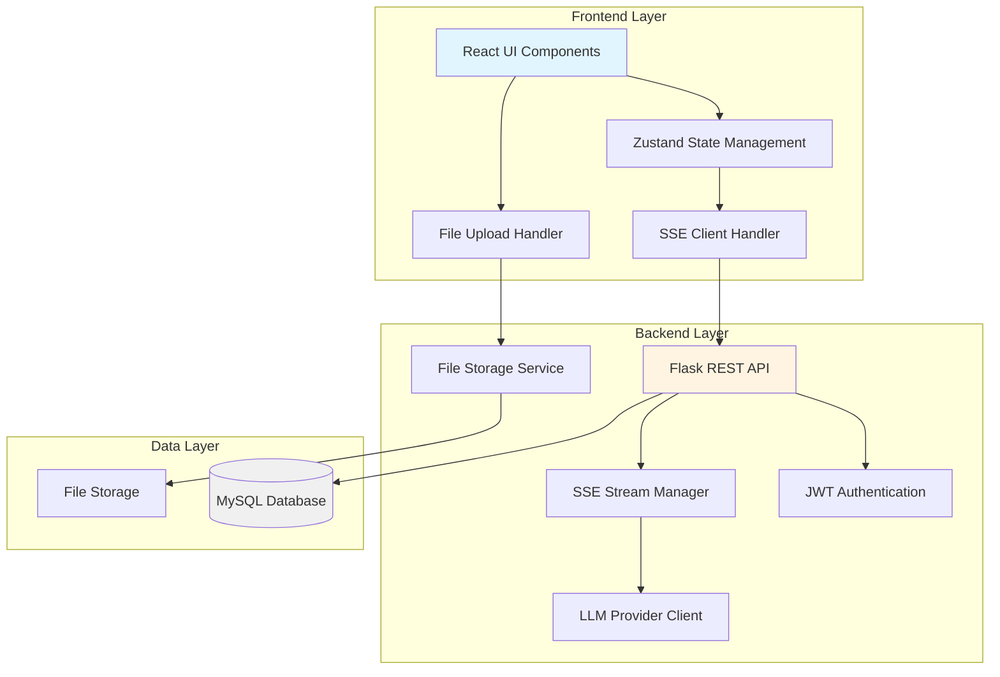

# Design Document: Minimalist Multimodal AI Assistant

## Overview

The Minimalist Multimodal AI Assistant is a full-stack web application that provides a streamlined chat interface with real-time streaming responses and architectural support for multimodal interactions. The system consists of three primary layers:

1. **Frontend**: React + Vite application with shadcn/ui components
2. **Backend**: Flask REST API with SSE streaming support
3. **Database**: MySQL with JSON column support for multimodal content

The design prioritizes ultra-smooth user experience through SSE streaming, optimistic UI updates, and a minimalist interface aesthetic. While the initial implementation focuses on text-based conversations, the architecture establishes a foundation for future multimodal capabilities (images, audio, documents) through a flexible JSON-based message content structure.

### Key Design Principles

- **Streaming-First**: Real-time token delivery with <500ms TTFT (Time To First Token)
- **Multimodal-Ready**: JSON content arrays support text, images, files, and audio
- **Minimalist UI**: Clean interface with limited color palette and subtle animations
- **OpenAI-Compatible**: Message format follows OpenAI API conventions for provider flexibility
- **Security-Focused**: JWT authentication, input sanitization, and CORS protection

## Architecture

### System Architecture Diagram



### Technology Stack

**Frontend**:
- React 18 with TypeScript
- Vite for build tooling
- shadcn/ui component library
- Tailwind CSS for styling
- Zustand for state management
- react-markdown for markdown rendering
- Prism.js for syntax highlighting
- KaTeX for mathematical expressions

**Backend**:
- Flask 3.x with Python 3.11+
- Flask-CORS for cross-origin support
- Flask-JWT-Extended for authentication
- SQLAlchemy 2.x for ORM
- PyJWT for token management
- requests library for LLM API calls

**Database**:
- MySQL 8.0+ (JSON column support required)
- Alembic for migrations

**Infrastructure**:
- File storage: Local filesystem or S3-compatible storage
- Environment-based configuration

### Component Interaction Flow

**Message Send Flow**:
1. User types message in Frontend input field
2. Frontend sends POST to `/api/chat/completions` with message content
3. Backend validates JWT token and session ownership
4. Backend persists user message to database
5. Backend establishes SSE connection and forwards request to LLM Provider
6. LLM Provider streams tokens back through Backend to Frontend
7. Frontend renders tokens in real-time
8. Backend persists complete assistant response to database

**File Upload Flow**:
1. User drags/drops file or clicks upload button
2. Frontend validates file type and size client-side
3. Frontend sends multipart POST to `/api/upload`
4. Backend validates file, generates unique filename
5. Backend stores file and returns public URL
6. Frontend displays preview and includes URL in message content array

## Components and Interfaces

### Frontend Components

#### Core Components

**ChatInterface** (Main Container)
- Manages overall layout with sidebar and chat area
- Handles responsive breakpoints (768px mobile threshold)
- Coordinates session switching and message loading

```typescript
interface ChatInterfaceProps {
  userId: string;
}

interface ChatInterfaceState {
  currentSessionId: string | null;
  isSidebarOpen: boolean;
  isLoading: boolean;
}
```

**SessionList** (Sidebar)
- Displays user's conversation sessions
- Shows session titles (first 50 chars of first message)
- Handles session creation and selection
- Ordered by most recent activity

```typescript
interface Session {
  id: string;
  title: string;
  updated_at: string;
}

interface SessionListProps {
  sessions: Session[];
  currentSessionId: string | null;
  onSessionSelect: (sessionId: string) => void;
  onNewSession: () => void;
}
```

**MessageList** (Chat Area)
- Renders message history with auto-scroll
- Displays user and assistant messages
- Shows loading skeletons during fetch
- Handles streaming message updates

```typescript
interface Message {
  id: string;
  role: 'user' | 'assistant' | 'system';
  content: ContentBlock[];
  raw_text: string;
  created_at: string;
  interrupted?: boolean;
}

interface ContentBlock {
  type: 'text' | 'image_url' | 'file' | 'audio';
  text?: string;
  image_url?: { url: string };
  file?: { url: string; name: string };
  audio?: { url: string };
}

interface MessageListProps {
  messages: Message[];
  streamingMessage: string | null;
  isStreaming: boolean;
}
```

**MessageBubble** (Individual Message)
- Renders message content with markdown support
- Applies syntax highlighting to code blocks
- Renders LaTeX expressions
- Displays multimodal content (images, files)

```typescript
interface MessageBubbleProps {
  message: Message;
  isStreaming?: boolean;
}
```

**InputArea** (Message Input)
- Auto-expanding textarea (max 300px height)
- Drag-and-drop file upload zone
- File preview thumbnails
- Send button with loading state

```typescript
interface InputAreaProps {
  onSendMessage: (content: ContentBlock[]) => void;
  isStreaming: boolean;
  onStopStreaming: () => void;
}

interface InputAreaState {
  text: string;
  attachedFiles: FileAttachment[];
  height: number;
}

interface FileAttachment {
  id: string;
  url: string;
  name: string;
  type: string;
  preview?: string;
}
```

#### Utility Components

**MarkdownRenderer**
- Converts markdown to HTML using react-markdown
- Integrates Prism.js for code highlighting
- Integrates KaTeX for math rendering
- Sanitizes HTML to prevent XSS

```typescript
interface MarkdownRendererProps {
  content: string;
  className?: string;
}
```

**FileUploadZone**
- Handles drag-and-drop events
- Shows visual drop indicator
- Validates file types and sizes
- Triggers upload to backend

```typescript
interface FileUploadZoneProps {
  onFilesUploaded: (files: FileAttachment[]) => void;
  maxFileSize: number; // 10MB
  allowedTypes: string[];
}
```

**SkeletonLoader**
- Displays loading placeholders
- Matches layout of actual content
- Pulsing animation effect

```typescript
interface SkeletonLoaderProps {
  type: 'session' | 'message';
  count?: number;
}
```

### Backend API Endpoints

#### Authentication Endpoints

**POST /api/auth/register**
- Creates new user account
- Hashes password with bcrypt
- Returns JWT token

Request:
```json
{
  "username": "string",
  "password": "string"
}
```

Response:
```json
{
  "access_token": "string",
  "user_id": "string"
}
```

**POST /api/auth/login**
- Validates credentials
- Generates JWT with 24-hour expiration
- Returns token and user info

Request:
```json
{
  "username": "string",
  "password": "string"
}
```

Response:
```json
{
  "access_token": "string",
  "user_id": "string",
  "username": "string"
}
```

#### Session Endpoints

**GET /api/sessions**
- Returns user's session list
- Ordered by updated_at DESC
- Requires JWT authentication

Response:
```json
{
  "sessions": [
    {
      "id": "string",
      "title": "string",
      "updated_at": "ISO8601 timestamp"
    }
  ]
}
```

**POST /api/sessions**
- Creates new session
- Associates with authenticated user
- Returns session ID

Response:
```json
{
  "session_id": "string",
  "created_at": "ISO8601 timestamp"
}
```

**GET /api/sessions/{session_id}/messages**
- Returns message history for session
- Ordered by created_at ASC
- Validates session ownership
- Returns within 500ms for up to 1000 messages

Response:
```json
{
  "messages": [
    {
      "id": "string",
      "role": "user|assistant|system",
      "content": [ContentBlock],
      "raw_text": "string",
      "created_at": "ISO8601 timestamp",
      "interrupted": false
    }
  ]
}
```

#### Chat Endpoints

**POST /api/chat/completions**
- Accepts message and session context
- Establishes SSE stream
- Forwards to LLM provider
- Streams response tokens
- Persists messages to database

Request:
```json
{
  "session_id": "string",
  "messages": [
    {
      "role": "user|assistant|system",
      "content": "string" | [ContentBlock]
    }
  ],
  "stream": true,
  "model": "string",
  "temperature": 0.7,
  "max_tokens": 4096
}
```

Response (SSE Stream):
```
data: {"choices": [{"delta": {"content": "token"}}]}

data: {"choices": [{"delta": {"content": "token"}}]}

data: [DONE]
```

#### File Upload Endpoint

**POST /api/upload**
- Accepts multipart file upload
- Validates type and size
- Stores file with unique name
- Returns public URL within 2 seconds

Request: multipart/form-data with file field

Response:
```json
{
  "url": "string",
  "filename": "string",
  "size": number,
  "type": "string"
}
```

Error Response:
```json
{
  "error": "string",
  "code": "INVALID_FILE_TYPE|FILE_TOO_LARGE"
}
```

### Backend Services

#### AuthService
- Password hashing with bcrypt (cost factor 12)
- JWT token generation and validation
- Token expiration: 24 hours
- Token payload: user_id, username, exp

```python
class AuthService:
    def hash_password(self, password: str) -> str
    def verify_password(self, password: str, hash: str) -> bool
    def generate_token(self, user_id: str) -> str
    def validate_token(self, token: str) -> dict
```

#### StreamService
- Manages SSE connections
- Forwards tokens from LLM provider
- Handles stream interruption
- Implements AbortController pattern

```python
class StreamService:
    def create_stream(self, session_id: str, messages: list) -> Generator
    def forward_token(self, token: str) -> None
    def close_stream(self, reason: str) -> None
```

#### ContextManager
- Calculates token counts for messages
- Truncates context when exceeding 80% of limit
- Preserves most recent 10 messages
- Always includes system prompt

```python
class ContextManager:
    def calculate_tokens(self, messages: list) -> int
    def truncate_context(self, messages: list, limit: int) -> list
    def prepare_context(self, session_id: str) -> list
```

#### FileStorageService
- Validates file types and sizes
- Generates unique filenames (UUID + extension)
- Stores files to configured storage backend
- Returns public URLs

```python
class FileStorageService:
    ALLOWED_TYPES = [
        'image/png', 'image/jpeg', 'image/gif',
        'application/pdf', 'audio/mpeg', 'audio/wav'
    ]
    MAX_SIZE = 10 * 1024 * 1024  # 10MB
    
    def validate_file(self, file: FileStorage) -> bool
    def store_file(self, file: FileStorage) -> str
    def generate_filename(self, original: str) -> str
```

#### MessageParser
- Parses JSON content arrays
- Validates content block structure
- Extracts raw_text from content blocks
- Provides pretty printing for debugging

```python
class MessageParser:
    def parse_content(self, content_json: str) -> list[ContentBlock]
    def validate_content_block(self, block: dict) -> bool
    def extract_raw_text(self, content: list[ContentBlock]) -> str
    def pretty_print(self, content: list[ContentBlock]) -> str
```

## Data Models

### Database Schema

```sql
-- Users table
CREATE TABLE users (
    id VARCHAR(36) PRIMARY KEY,
    username VARCHAR(255) UNIQUE NOT NULL,
    password_hash VARCHAR(255) NOT NULL,
    created_at TIMESTAMP DEFAULT CURRENT_TIMESTAMP,
    INDEX idx_username (username)
);

-- Sessions table
CREATE TABLE sessions (
    id VARCHAR(36) PRIMARY KEY,
    user_id VARCHAR(36) NOT NULL,
    title VARCHAR(255),
    updated_at TIMESTAMP DEFAULT CURRENT_TIMESTAMP ON UPDATE CURRENT_TIMESTAMP,
    created_at TIMESTAMP DEFAULT CURRENT_TIMESTAMP,
    FOREIGN KEY (user_id) REFERENCES users(id) ON DELETE CASCADE,
    INDEX idx_user_updated (user_id, updated_at DESC)
);

-- Messages table
CREATE TABLE messages (
    id VARCHAR(36) PRIMARY KEY,
    session_id VARCHAR(36) NOT NULL,
    role ENUM('user', 'assistant', 'system') NOT NULL,
    content JSON NOT NULL,
    raw_text TEXT,
    interrupted BOOLEAN DEFAULT FALSE,
    created_at TIMESTAMP(3) DEFAULT CURRENT_TIMESTAMP(3),
    FOREIGN KEY (session_id) REFERENCES sessions(id) ON DELETE CASCADE,
    INDEX idx_session_created (session_id, created_at ASC),
    FULLTEXT INDEX idx_raw_text (raw_text)
);
```

### SQLAlchemy Models

```python
from sqlalchemy import Column, String, Text, Boolean, DateTime, Enum, ForeignKey, JSON
from sqlalchemy.orm import relationship
from datetime import datetime
import uuid

class User(Base):
    __tablename__ = 'users'
    
    id = Column(String(36), primary_key=True, default=lambda: str(uuid.uuid4()))
    username = Column(String(255), unique=True, nullable=False)
    password_hash = Column(String(255), nullable=False)
    created_at = Column(DateTime, default=datetime.utcnow)
    
    sessions = relationship('Session', back_populates='user', cascade='all, delete-orphan')

class Session(Base):
    __tablename__ = 'sessions'
    
    id = Column(String(36), primary_key=True, default=lambda: str(uuid.uuid4()))
    user_id = Column(String(36), ForeignKey('users.id'), nullable=False)
    title = Column(String(255))
    updated_at = Column(DateTime, default=datetime.utcnow, onupdate=datetime.utcnow)
    created_at = Column(DateTime, default=datetime.utcnow)
    
    user = relationship('User', back_populates='sessions')
    messages = relationship('Message', back_populates='session', cascade='all, delete-orphan')

class Message(Base):
    __tablename__ = 'messages'
    
    id = Column(String(36), primary_key=True, default=lambda: str(uuid.uuid4()))
    session_id = Column(String(36), ForeignKey('sessions.id'), nullable=False)
    role = Column(Enum('user', 'assistant', 'system'), nullable=False)
    content = Column(JSON, nullable=False)
    raw_text = Column(Text)
    interrupted = Column(Boolean, default=False)
    created_at = Column(DateTime(3), default=datetime.utcnow)
    
    session = relationship('Session', back_populates='messages')
```

### Content Block JSON Schema

The `content` column stores an array of content blocks following this schema:

```json
{
  "$schema": "http://json-schema.org/draft-07/schema#",
  "type": "array",
  "items": {
    "oneOf": [
      {
        "type": "object",
        "properties": {
          "type": { "const": "text" },
          "text": { "type": "string" }
        },
        "required": ["type", "text"]
      },
      {
        "type": "object",
        "properties": {
          "type": { "const": "image_url" },
          "image_url": {
            "type": "object",
            "properties": {
              "url": { "type": "string", "format": "uri" }
            },
            "required": ["url"]
          }
        },
        "required": ["type", "image_url"]
      },
      {
        "type": "object",
        "properties": {
          "type": { "const": "file" },
          "file": {
            "type": "object",
            "properties": {
              "url": { "type": "string", "format": "uri" },
              "name": { "type": "string" }
            },
            "required": ["url", "name"]
          }
        },
        "required": ["type", "file"]
      },
      {
        "type": "object",
        "properties": {
          "type": { "const": "audio" },
          "audio": {
            "type": "object",
            "properties": {
              "url": { "type": "string", "format": "uri" }
            },
            "required": ["url"]
          }
        },
        "required": ["type", "audio"]
      }
    ]
  }
}
```

Example content values:

```json
// Text-only message
[
  { "type": "text", "text": "Hello, how can I help you?" }
]

// Multimodal message with text and image
[
  { "type": "text", "text": "Here's the diagram you requested:" },
  { "type": "image_url", "image_url": { "url": "https://example.com/diagram.png" } }
]

// Message with file attachment
[
  { "type": "text", "text": "Please review this document:" },
  { "type": "file", "file": { "url": "https://example.com/doc.pdf", "name": "report.pdf" } }
]
```

## SSE Streaming Implementation

### Backend SSE Stream Handler

```python
from flask import Response, stream_with_context
import json
import requests

def create_sse_stream(session_id: str, messages: list, model_config: dict):
    """
    Creates an SSE stream that forwards LLM provider responses to the client.
    """
    def generate():
        try:
            # Prepare context with truncation
            context = context_manager.prepare_context(session_id)
            context.append(messages[-1])  # Add new user message
            
            # Call LLM provider with streaming
            response = requests.post(
                config.LLM_ENDPOINT,
                headers={
                    'Authorization': f'Bearer {config.LLM_API_KEY}',
                    'Content-Type': 'application/json'
                },
                json={
                    'model': model_config.get('model', 'deepseek-chat'),
                    'messages': context,
                    'stream': True,
                    'temperature': model_config.get('temperature', 0.7),
                    'max_tokens': model_config.get('max_tokens', 4096)
                },
                stream=True,
                timeout=30
            )
            
            response.raise_for_status()
            
            # Forward tokens as SSE events
            full_response = ""
            for line in response.iter_lines():
                if line:
                    line_str = line.decode('utf-8')
                    if line_str.startswith('data: '):
                        data = line_str[6:]
                        if data == '[DONE]':
                            yield f"data: [DONE]\n\n"
                            break
                        
                        # Forward token
                        yield f"data: {data}\n\n"
                        
                        # Accumulate response
                        try:
                            chunk = json.loads(data)
                            if 'choices' in chunk and len(chunk['choices']) > 0:
                                delta = chunk['choices'][0].get('delta', {})
                                content = delta.get('content', '')
                                full_response += content
                        except json.JSONDecodeError:
                            pass
            
            # Persist complete response
            message_service.create_message(
                session_id=session_id,
                role='assistant',
                content=[{'type': 'text', 'text': full_response}],
                raw_text=full_response
            )
            
        except requests.exceptions.RequestException as e:
            error_data = json.dumps({'error': str(e), 'code': 'LLM_ERROR'})
            yield f"data: {error_data}\n\n"
        except Exception as e:
            error_data = json.dumps({'error': 'Internal server error', 'code': 'SERVER_ERROR'})
            yield f"data: {error_data}\n\n"
    
    return Response(
        stream_with_context(generate()),
        mimetype='text/event-stream',
        headers={
            'Cache-Control': 'no-cache',
            'X-Accel-Buffering': 'no'
        }
    )
```

### Frontend SSE Client

```typescript
class SSEClient {
  private abortController: AbortController | null = null;
  
  async streamCompletion(
    sessionId: string,
    messages: Message[],
    onToken: (token: string) => void,
    onComplete: () => void,
    onError: (error: Error) => void
  ): Promise<void> {
    this.abortController = new AbortController();
    
    try {
      const response = await fetch('/api/chat/completions', {
        method: 'POST',
        headers: {
          'Content-Type': 'application/json',
          'Authorization': `Bearer ${getToken()}`
        },
        body: JSON.stringify({
          session_id: sessionId,
          messages: messages,
          stream: true
        }),
        signal: this.abortController.signal
      });
      
      if (!response.ok) {
        throw new Error(`HTTP ${response.status}: ${response.statusText}`);
      }
      
      const reader = response.body?.getReader();
      const decoder = new TextDecoder();
      
      if (!reader) {
        throw new Error('Response body is not readable');
      }
      
      while (true) {
        const { done, value } = await reader.read();
        
        if (done) break;
        
        const chunk = decoder.decode(value, { stream: true });
        const lines = chunk.split('\n');
        
        for (const line of lines) {
          if (line.startsWith('data: ')) {
            const data = line.slice(6);
            
            if (data === '[DONE]') {
              onComplete();
              return;
            }
            
            try {
              const parsed = JSON.parse(data);
              if (parsed.choices?.[0]?.delta?.content) {
                onToken(parsed.choices[0].delta.content);
              }
            } catch (e) {
              console.error('Failed to parse SSE data:', e);
            }
          }
        }
      }
    } catch (error) {
      if (error.name === 'AbortError') {
        console.log('Stream aborted by user');
      } else {
        onError(error as Error);
      }
    }
  }
  
  abort(): void {
    if (this.abortController) {
      this.abortController.abort();
      this.abortController = null;
    }
  }
}
```

